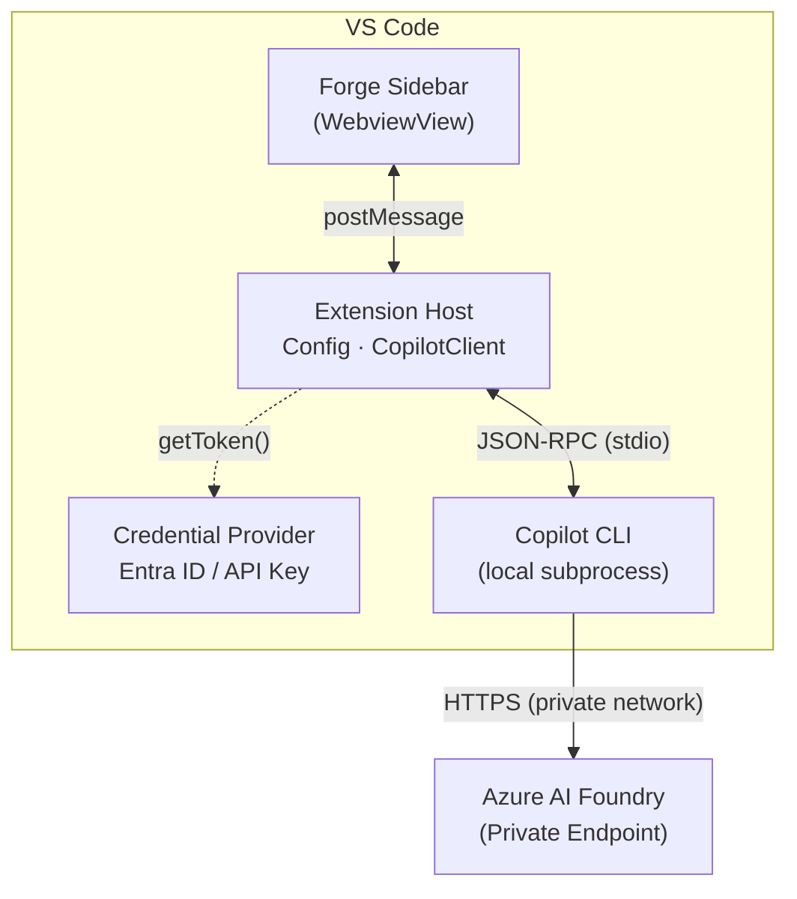

# Forge
<p align="center"></p>


A VS Code chat extension that routes AI chat through your own Azure AI Foundry endpoint — giving your organization full control over model inference. All inference stays within your Azure tenant. No GitHub authentication required. Works in air-gapped and compliance-driven environments.

The extension uses the GitHub Copilot SDK (`@github/copilot-sdk`) in BYOK (Bring Your Own Key) mode to route all model inference to a private **Azure AI Foundry** endpoint within your Azure tenant.

## Prerequisites

- **VS Code** 1.93 or later
- **[GitHub Copilot CLI](https://github.com/github/copilot-cli)**
- **[Azure CLI](https://learn.microsoft.com/en-us/cli/azure/install-azure-cli)** (`az`) — Required for Entra ID authentication (recommended for most environments)
- **Azure AI Foundry** endpoint and model deployment(s)

## Quick Start

Ensure you've installed the [prerequisites](#prerequisites) before starting.

1. **Install the Forge extension** — download the `.vsix` from [GitHub Releases](https://github.com/robpitcher/forge/releases) and sideload it (see [Installation](#installation) for details).

2. **Configure settings** in VS Code (`File > Preferences > Settings`, search for `Forge`):

   | Setting | Description |
   |---------|-------------|
   | `forge.copilot.endpoint` | Your Azure AI Foundry endpoint URL (e.g., `https://myresource.openai.azure.com/`) |
   | `forge.copilot.authMethod` | Auth method: `"entraId"` (default) or `"apiKey"` |
   | `forge.copilot.models` | Deployment names from your Azure AI Foundry (e.g., `["gpt-4.1", "gpt-4o"]`) |

   **API Key (if using `apiKey` auth):** Click the ⚙️ gear icon in the Forge chat toolbar and select "Set API Key (secure)".

3. **Open Forge:** Click the Forge icon in the VS Code sidebar

4. **Send a message:** Type a message in the input field, then press **Enter** to send (Shift+Enter for newline)

5. **Multi-turn conversations:** The chat maintains session context within the same session

## Features

### Authentication Methods

Forge supports two authentication methods, controlled by `forge.copilot.authMethod`:

- **Entra ID** (default) — Uses `DefaultAzureCredential` from `@azure/identity`. Authenticate via `az login` or managed identity. Recommended for environments with Azure AD.
- **API Key** — Uses a static API key stored securely in VS Code SecretStorage. Set via the ⚙️ gear icon → "Set API Key (secure)". Use for environments without Entra ID.

### Code Actions

Right-click on code or use the editor lightbulb menu (💡) to access:

- **Explain with Forge** — Get an explanation of selected code
- **Fix with Forge** — Ask Forge to fix selected code
- **Write Tests with Forge** — Generate tests for selected code

### Model Selector

Use the model dropdown in the chat UI to switch between configured deployment names. Models are configured via `forge.copilot.models` — values must match the **deployment name** in Azure AI Foundry, not the underlying model name.

## Usage

### Start a chat

1. Click the Forge icon in the VS Code sidebar to open the Forge chat
2. Type your message in the input field
3. Press **Enter** to send (Shift+Enter for newline)

### Example prompts

- `Explain how this function works`
- `Write a unit test for this code`
- `What are the performance implications?`

## Architecture



## Installation

### From GitHub Releases (recommended for restricted or air-gapped networks)

1. Download the latest `.vsix` file from [GitHub Releases](https://github.com/robpitcher/forge/releases)
2. In VS Code, open Extensions (`Ctrl+Shift+X` / `Cmd+Shift+X`)
3. Click `...` → **Install from VSIX...**
4. Select the downloaded `.vsix` file

### From VS Code Marketplace

Forge publishes **pre-release** builds to the VS Code Marketplace. Insider/development versions appear under **Pre-Release** in the extension details. For stable installations in restricted or air-gapped environments, use GitHub Releases above.

## Configuration

Configure settings in VS Code (`Ctrl+,` / `Cmd+,`):

### Core Settings

| Setting | Type | Required | Default | Description |
|---------|------|----------|---------|-------------|
| `forge.copilot.endpoint` | `string` | Yes | `""` | Azure AI Foundry endpoint URL (e.g., `https://myresource.openai.azure.com/`) |
| `forge.copilot.models` | `string[]` | No | `[]` | Azure AI Foundry deployment names for the model selector. Must match the deployment name in Foundry, not the underlying model name. First entry is the default. |
| `forge.copilot.wireApi` | `string` | No | `"completions"` | API format: `"completions"` or `"responses"` |
| `forge.copilot.cliPath` | `string` | No | `""` | Path to Copilot CLI binary (if not on PATH) |
| `forge.copilot.authMethod` | `string` | No | `"entraId"` | Auth method: `"entraId"` (DefaultAzureCredential) or `"apiKey"` |
| `forge.copilot.systemMessage` | `string` | No | `""` | Custom system message appended to the default Copilot system prompt |

### Tool Settings

| Setting | Type | Default | Description |
|---------|------|---------|-------------|
| `forge.copilot.autoApproveTools` | `boolean` | `false` | Auto-approve tool executions without confirmation |
| `forge.copilot.tools.shell` | `boolean` | `true` | Enable the Shell tool (execute terminal commands) |
| `forge.copilot.tools.read` | `boolean` | `true` | Enable the Read tool (read file contents) |
| `forge.copilot.tools.write` | `boolean` | `true` | Enable the Write tool (write/edit files) |
| `forge.copilot.tools.url` | `boolean` | `false` | Enable the URL tool (fetch web content) |
| `forge.copilot.tools.mcp` | `boolean` | `true` | Enable MCP tool support (Model Context Protocol servers) |

### MCP Settings

| Setting | Type | Default | Description |
|---------|------|---------|-------------|
| `forge.copilot.mcpAllowRemote` | `boolean` | `false` | Allow remote (HTTP/SSE) MCP servers |
| `forge.copilot.mcpServers` | `object` | `{}` | MCP server configurations (see below) |

**MCP Server Configuration:**

```json
{
  "forge.copilot.mcpServers": {
    "my-local-server": {
      "command": "npx",
      "args": ["-y", "@my/mcp-server"],
      "env": { "API_KEY": "..." }
    },
    "my-remote-server": {
      "url": "http://internal-host:3000/sse",
      "headers": { "Authorization": "Bearer ..." }
    }
  }
}
```

### Example Configuration

```json
{
  "forge.copilot.endpoint": "https://myresource.openai.azure.com/",
  "forge.copilot.authMethod": "entraId",
  "forge.copilot.models": ["gpt-4.1", "gpt-4o"],
  "forge.copilot.wireApi": "completions"
}
```

> **Note:** The SDK auto-appends `/openai/v1/` for `.azure.com` endpoints — do not include this path in your endpoint URL.

**API Key Setup:** Click the ⚙️ gear icon in the Forge chat toolbar and select "Set API Key (secure)" to enter your API key via a masked password input. The key is stored securely in VS Code SecretStorage and never appears in settings.json.

---

## Development

**Recommended environment:** The included `.devcontainer/devcontainer.json` provides a pre-configured development setup with Node.js, Git, GitHub CLI, and Azure CLI. Open in [GitHub Codespaces](https://github.com/codespaces/new?repo=robpitcher/forge) or [VS Code Dev Containers](https://marketplace.visualstudio.com/items?itemName=ms-vscode-remote.remote-containers) for a seamless setup.

### Install dependencies

```bash
npm ci
```

### Build

```bash
npm run build
```

Bundles the extension and SDK into `dist/extension.js`.

### Watch mode

```bash
npm run watch
```

Rebuilds on file changes.

### Linting

```bash
npm run lint        # ESLint
npm run lint:types  # TypeScript type-checking (tsc --noEmit)
```

Lints source code with ESLint. Use `lint:types` for TypeScript type-checking.

### Testing

```bash
npm run test
```

Runs automated tests with Vitest.

### Package for distribution

```bash
npm run package
```

Creates a `.vsix` package (named `forge-<version>.vsix`) for sideloading or distribution.

---

## License

[MIT](LICENSE)
