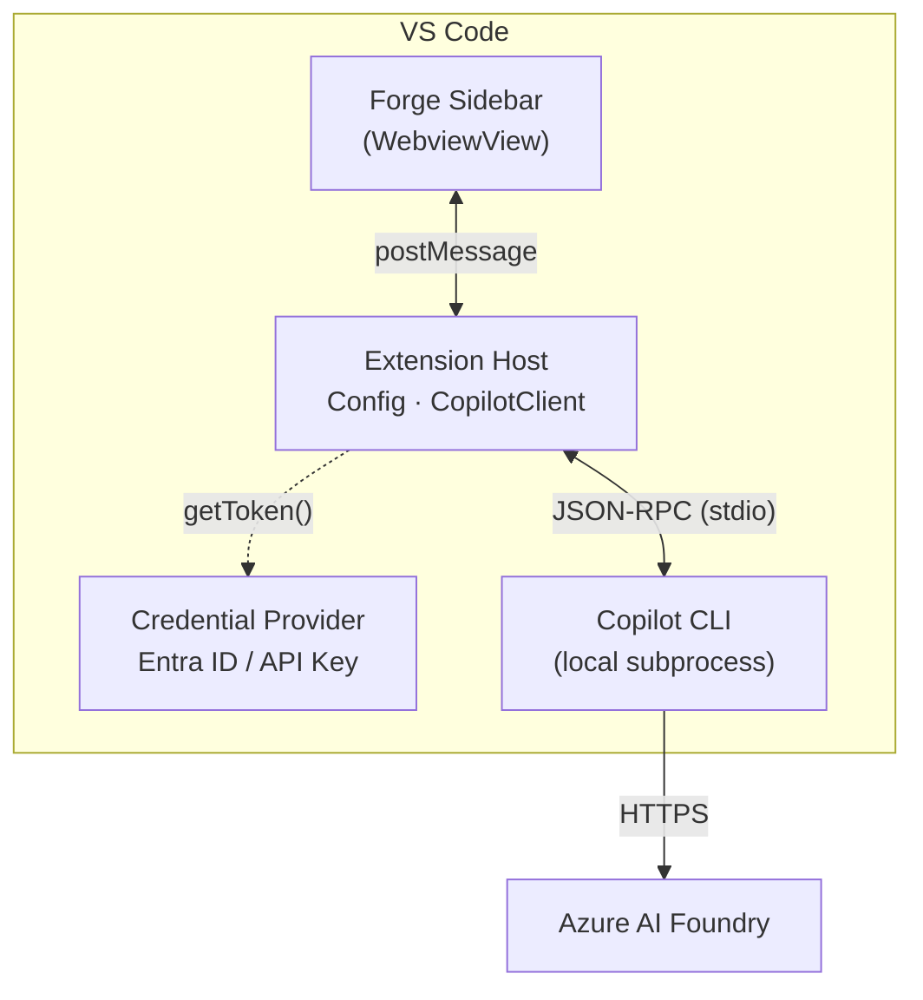

# Forge
<p align="center"></p>


A VS Code chat extension that routes AI chat through your own Azure AI Foundry endpoint — giving your organization full control over model inference. All inference stays within your Azure tenant. No GitHub authentication required. Works in air-gapped and compliance-driven environments.

The extension uses the GitHub Copilot SDK (`@github/copilot-sdk`) in BYOK (Bring Your Own Key) mode to route all model inference to a private **Azure AI Foundry** endpoint within your Azure tenant.

📖 **[Features & Usage](docs/features-and-usage.md)** — Authentication methods, code actions, model selector, and usage guide.

## Prerequisites

- **VS Code** 1.93 or later
- **[GitHub Copilot CLI](https://github.com/github/copilot-cli)**
- **[Azure CLI](https://learn.microsoft.com/en-us/cli/azure/install-azure-cli)** (`az`) — Required for Entra ID authentication (recommended for most environments)
- **Azure AI Foundry** endpoint and model deployment(s)

## Quick Start

Ensure you've installed the [prerequisites](#prerequisites) before starting.

1. **Install the Forge extension** — Search for "Forge" in the VS Code Extensions panel, or install via the [VS Code Marketplace](https://marketplace.visualstudio.com/items?itemName=robpitcher.forge). If your environment doesn't have Marketplace access, see [Installation](#installation) for the sideload option.

2. **Configure settings** in VS Code (`File > Preferences > Settings`, search for `Forge`):

   | Setting | Description |
   |---------|-------------|
   | `forge.copilot.endpoint` | Your Azure AI Foundry endpoint URL (e.g., `https://myresource.openai.azure.com/`) |
   | `forge.copilot.authMethod` | Auth method: `"entraId"` (default) or `"apiKey"` |
   | `forge.copilot.models` | Deployment names from your Azure AI Foundry (e.g., `["gpt-4.1", "gpt-4o"]`) |

   **API Key (if using `apiKey` auth):** Click the ⚙️ gear icon in the Forge chat toolbar and select "Set API Key (secure)".

3. **Open Forge:** Click the Forge icon in the VS Code sidebar

4. **Send a message:** Type a message in the input field, then press **Enter** to send (Shift+Enter for newline)

5. **Multi-turn conversations:** The chat maintains session context within the same session

## Architecture

### Basic



> For a full enterprise topology with Azure API Management, private networking, observability, and Entra ID auth flows, see the example [Enterprise Architecture](docs/enterprise-architecture.md) reference.

## Installation

### From VS Code Marketplace (recommended)

1. Open VS Code Extensions (`Ctrl+Shift+X` / `Cmd+Shift+X`)
2. Search for **"Forge"** or visit the [Forge Marketplace page](https://marketplace.visualstudio.com/items?itemName=robpitcher.forge)
3. Click **Install**
4. Forge publishes **pre-release** builds to the marketplace — check the **Pre-Release** tab for development versions

### From GitHub Releases (for restricted or air-gapped networks)

1. Download the latest `.vsix` file from [GitHub Releases](https://github.com/robpitcher/forge/releases)
2. In VS Code, open Extensions (`Ctrl+Shift+X` / `Cmd+Shift+X`)
3. Click `...` → **Install from VSIX...**
4. Select the downloaded `.vsix` file

## Configuration

For a quick overview of required and optional settings, see the table below. For detailed explanations, Azure setup instructions, and troubleshooting, see the **[Configuration Reference](docs/configuration-reference.md)**.

### Core Settings

| Setting | Type | Required | Default | Description |
|---------|------|----------|---------|-------------|
| `forge.copilot.endpoint` | `string` | Yes | `""` | Azure AI Foundry endpoint URL (e.g., `https://myresource.openai.azure.com/`) |
| `forge.copilot.models` | `string[]` | No | `[]` | Azure AI Foundry deployment names for the model selector. Must match the deployment name in Foundry, not the underlying model name. First entry is the default. |
| `forge.copilot.wireApi` | `string` | No | `"completions"` | API format: `"completions"` or `"responses"` |
| `forge.copilot.cliPath` | `string` | No | `""` | Path to Copilot CLI binary (if not on PATH) |
| `forge.copilot.authMethod` | `string` | No | `"entraId"` | Auth method: `"entraId"` (DefaultAzureCredential) or `"apiKey"` |
| `forge.copilot.systemMessage` | `string` | No | `""` | Custom system message appended to the default Copilot system prompt |

### Example Configuration

```json
{
  "forge.copilot.endpoint": "https://myresource.openai.azure.com/",
  "forge.copilot.authMethod": "entraId",
  "forge.copilot.models": ["gpt-4.1", "gpt-4o"],
  "forge.copilot.wireApi": "completions"
}
```

> **Note:** The SDK auto-appends `/openai/v1/` for `.azure.com` endpoints — do not include this path in your endpoint URL.

## Contributing

See **[CONTRIBUTING.md](CONTRIBUTING.md)** for development setup, building, testing, and packaging instructions.

---

## License

[MIT](LICENSE)
