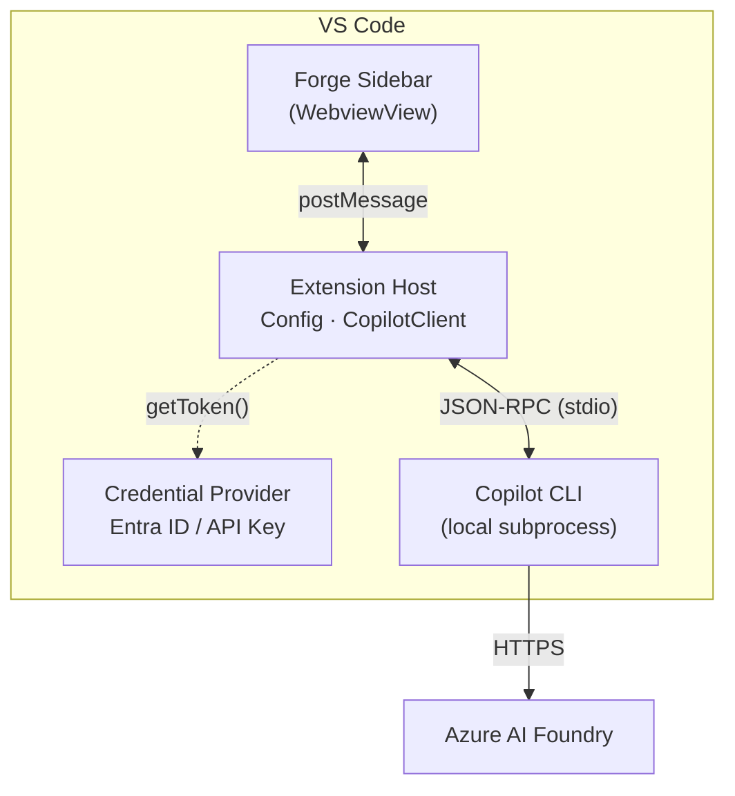

<p align="center"></p>

# Forge Documentation

> Quick-reference guide covering what Forge does, how to set it up, and how it handles responsible AI.

📖 **See also:** [Features & Usage](features-and-usage.md) · [Configuration Reference](configuration-reference.md) · [Enterprise Architecture](enterprise-architecture.md)

---

## Problem → Solution

Organizations that operate in air-gapped, sovereign-cloud, or compliance-driven environments can't use cloud-hosted AI assistants that route inference through third-party services. They need AI chat capabilities that stay entirely within their own Azure tenant — with no external dependencies and no data leaving their network boundary.

**Forge** is a VS Code chat extension that solves this by routing all model inference to a private **Azure AI Foundry** endpoint that you control. It uses the GitHub Copilot SDK (`@github/copilot-sdk`) in BYOK (Bring Your Own Key) mode, so there's no GitHub authentication, no internet dependency, and no third-party data transfer. You get a full-featured AI chat experience — multi-turn conversations, code actions, model selection — backed by your organization's own infrastructure.

Authentication defaults to **Entra ID** (Azure AD), and all configuration lives in VS Code settings. Point Forge at your endpoint, pick your deployed models, and start chatting.

---

## Prerequisites

Before installing Forge, ensure you have:

| Requirement | Details |
|---|---|
| **VS Code** | 1.93 or later |
| **[GitHub Copilot CLI](https://github.com/github/copilot-cli)** | Local subprocess used by the Copilot SDK |
| **[Azure CLI](https://learn.microsoft.com/en-us/cli/azure/install-azure-cli)** (`az`) | Required for Entra ID authentication (recommended) |
| **Azure AI Foundry** | An endpoint with at least one model deployment |

---

## Setup

After installing the extension, configure it in VS Code (`File > Preferences > Settings`, search for `Forge`):

### Core Settings

| Setting | Type | Required | Default | Description |
|---------|------|----------|---------|-------------|
| `forge.copilot.endpoint` | `string` | Yes | `""` | Azure AI Foundry endpoint URL (e.g., `https://myresource.openai.azure.com/`) |
| `forge.copilot.models` | `string[]` | No | `[]` | Deployment names from your Azure AI Foundry. Must match the **deployment name** in Foundry, not the underlying model name. First entry is the default. |
| `forge.copilot.wireApi` | `string` | No | `"completions"` | API format: `"completions"` or `"responses"` |
| `forge.copilot.cliPath` | `string` | No | `""` | Path to Copilot CLI binary (if not on PATH) |
| `forge.copilot.authMethod` | `string` | No | `"entraId"` | Auth method: `"entraId"` (DefaultAzureCredential) or `"apiKey"` |
| `forge.copilot.systemMessage` | `string` | No | `""` | Custom system message appended to the default Copilot system prompt |

### Example Configuration

```json
{
  "forge.copilot.endpoint": "https://myresource.openai.azure.com/",
  "forge.copilot.authMethod": "entraId",
  "forge.copilot.models": ["gpt-4.1", "gpt-4o"],
  "forge.copilot.wireApi": "completions"
}
```

> **Note:** The SDK auto-appends `/openai/v1/` for `.azure.com` endpoints — do not include this path in your endpoint URL.

**API Key users:** If using `apiKey` auth, click the ⚙️ gear icon in the Forge chat toolbar and select "Set API Key (secure)". Keys are stored in VS Code SecretStorage, never in settings files.

For detailed explanations, Azure setup instructions, and troubleshooting, see the **[Configuration Reference](configuration-reference.md)**.

---

## Deployment

### VS Code Marketplace

Search for **"forge-ai"** in the VS Code Extensions panel, or install directly from the [VS Code Marketplace](https://marketplace.visualstudio.com/items?itemName=robpitcher.forge-ai).

### Sideload Installation (Air-Gapped Networks)

For environments without Marketplace access:

1. Download the latest `.vsix` file from [GitHub Releases](https://github.com/robpitcher/forge/releases)
2. Transfer the `.vsix` to the target machine (USB, internal share, etc.)
3. In VS Code, open Extensions (`Ctrl+Shift+X` / `Cmd+Shift+X`)
4. Click `...` → **Install from VSIX...**
5. Select the `.vsix` file

---

## Architecture Diagram



This shows the basic flow: the Forge sidebar communicates with the extension host, which manages credentials and delegates inference to the Copilot CLI subprocess. The CLI makes HTTPS calls to your Azure AI Foundry endpoint. When using Entra ID authentication, the extension host also contacts Azure AD for token acquisition.

For the full enterprise topology — including Azure API Management, VNet integration, private endpoints, and Entra ID auth flows — see the **[Enterprise Architecture](enterprise-architecture.md)** reference.

---

## Responsible AI

Forge is designed with security and data governance as defaults, not opt-ins.

### Authentication & Access Control

- **Entra ID is the default authentication method.** This limits access to the user's Azure AD scope and integrates with your organization's existing identity policies. API key auth is available but not recommended for production use.

### Tool Use & MCP Servers

- **Web and remote MCP servers are disabled by default.** Forge does not reach out to external tool servers unless explicitly configured.
- **Tool execution requires explicit user approval.** When a model requests tool use, Forge prompts the user for confirmation before executing — no tools run silently.
- **Auto tool approval is disabled by default.** Each tool invocation requires a manual approval step unless the user opts in to auto-approval.

### Data Sovereignty

- **All inference stays within your Azure tenant.** Forge routes every request to your configured Azure AI Foundry endpoint. No prompts, responses, or telemetry are sent to third-party services.
- **Azure AI Foundry includes built-in content filtering**, enabled by default on all deployments. See the [Azure AI Content Safety](https://learn.microsoft.com/en-us/azure/ai-services/content-safety/overview) documentation for details on configuring content filters for your deployments.
