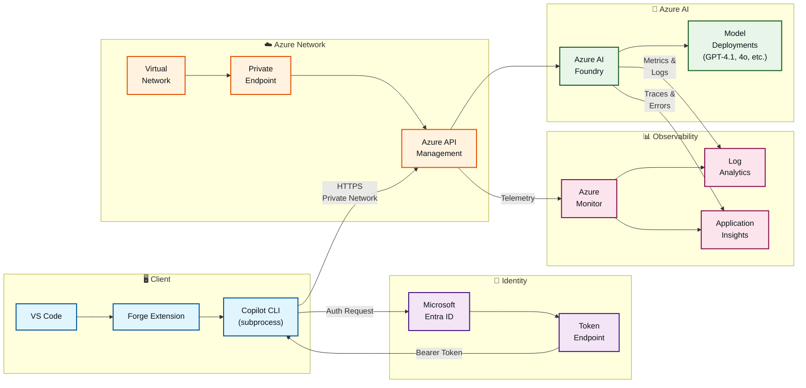

# Enterprise Architecture

> Reference architecture for deploying Forge in enterprise environments with Azure API Management, private networking, observability, and Entra ID authentication. This extends the basic README diagram to show the full service topology and security controls.

## Architecture Diagram

## Components

| Component | Role |
|-----------|------|
| **VS Code** | User workstation running the Forge chat extension |
| **Forge Extension** | VS Code extension providing the chat UI (WebviewView) and orchestrating message handling |
| **Copilot CLI** | Local subprocess spawned by the extension; handles SDK lifecycle and session management (BYOK mode) |
| **Microsoft Entra ID** | Identity provider; issues bearer tokens for authenticated requests to APIM and AI Foundry |
| **Azure API Management** | Enterprise gateway sitting in front of AI Foundry; handles rate limiting, policy enforcement, request routing, and telemetry collection |
| **Private Endpoint** | Network boundary control; ensures traffic to APIM stays within the VNet (no internet transit) |
| **Virtual Network** | Isolated Azure network boundary containing APIM and AI Foundry; enforces private connectivity |
| **Azure AI Foundry** | Managed AI service hosting the model deployments; receives requests through APIM |
| **Model Deployments** | Individual model instances (GPT-4.1, GPT-4o, etc.) provisioned in AI Foundry |
| **Azure Monitor** | Central observability hub collecting metrics, logs, and traces from all Azure services |
| **Log Analytics** | Long-term storage and query engine for structured logs from APIM and AI Foundry |
| **Application Insights** | Application-level monitoring for errors, traces, and request telemetry |

## Authentication & Authorization Flow

1. **Token Acquisition:** Copilot CLI calls `DefaultAzureCredential` (or retrieves cached token) to authenticate with Entra ID via the Token Endpoint
2. **Bearer Token:** Token is attached as `Authorization: Bearer <token>` in HTTPS requests from CLI to APIM
3. **APIM Validation:** APIM validates the token and applies policies (rate limiting, caching, request/response transformation)
4. **AI Foundry Access:** Once policies pass, APIM routes the request to the appropriate model deployment in AI Foundry

## Private Networking & Security

- **Private Endpoint:** Ensures traffic from client to APIM never traverses the public internet — all data flows through the VNet
- **Network Policies:** APIM is deployed within the VNet with firewall rules restricting inbound access to authorized clients only
- **Encryption in Transit:** All connections use TLS 1.2+ (HTTPS)
- **Encryption at Rest:** Azure AI Foundry and Log Analytics automatically encrypt data at rest using Microsoft-managed or customer-managed keys

## Observability & Monitoring

- **APIM Telemetry:** Tracks all incoming requests (latency, errors, client info) → forwarded to Azure Monitor
- **AI Foundry Metrics:** Model deployment health, token usage, errors, inference latency → Log Analytics
- **Application Insights:** Copilot CLI can emit structured traces (e.g., token acquisition time, SDK initialization duration) → Application Insights
- **Log Analytics Queries:** Central dashboard for searching logs, setting alerts, and analyzing trends across APIM and AI Foundry

## Deployment Considerations

- **Multi-tenant:** Deploy one set of Azure services per organization or business unit; Entra ID tenant isolation enforces access control
- **Scaling:** APIM auto-scales based on request volume; AI Foundry scales model deployments independently
- **Compliance:** Private networking and Entra ID integration support air-gap and regulatory requirements (e.g., no internet egress)
- **Cost Optimization:** Use APIM caching policies to reduce redundant calls to AI Foundry; monitor token usage via Log Analytics to optimize quota

## Notes

- This diagram assumes **Entra ID as the identity provider**. For API Key authentication, replace Entra ID with a secure key vault (Azure Key Vault) and retrieve keys at deployment time — never embed in extension code.
- **APIM Policies** typically include:
  - JWT validation (Entra ID token)
  - Rate limiting (per-user or per-organization)
  - Request/response caching
  - Header transformation (adding deployment name, API version)
  - Conditional routing (route to different models based on request parameters)
- **Private Endpoint DNS:** Configure Azure Private DNS Zone to resolve the AI Foundry endpoint to the private IP, preventing accidental routing to the public internet
- **Diagnostics:** Enable APIM request logging to Log Analytics to debug authentication failures, policy violations, or backend errors
