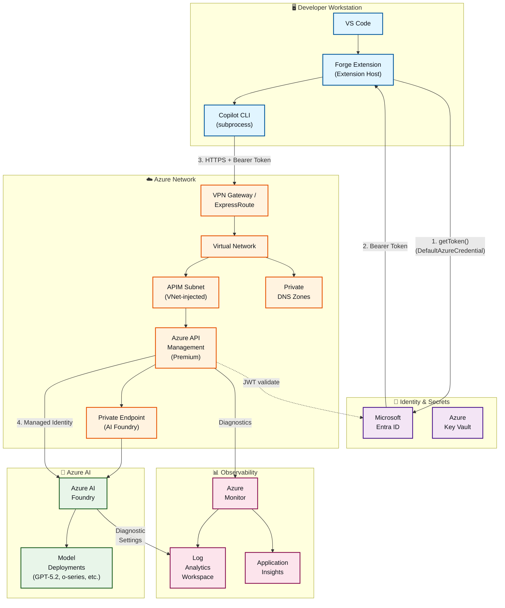

# Enterprise Architecture

> Reference architecture for deploying Forge in enterprise environments with Azure API Management, private networking, observability, and Entra ID authentication. This extends the basic README diagram to show the full service topology and security controls.

## Architecture Diagram



## Components

| Component | Role |
|-----------|------|
| **VS Code** | Developer workstation running the Forge chat extension |
| **Forge Extension (Extension Host)** | VS Code extension providing the chat UI (WebviewView), orchestrating message handling, and **acquiring Entra ID tokens** via `DefaultAzureCredential` |
| **Copilot CLI** | Local subprocess spawned by the extension; handles SDK lifecycle and session management (BYOK mode). Receives the bearer token from the extension — does NOT authenticate directly |
| **Microsoft Entra ID** | Identity provider; issues OAuth 2.0 bearer tokens for authenticated requests. The extension host calls `DefaultAzureCredential.getToken()` with the `https://cognitiveservices.azure.com/.default` scope |
| **Azure Key Vault** | Stores API keys, TLS certificates, and APIM policy secrets. Referenced by APIM named values and by the API Key auth path |
| **Azure API Management (Premium)** | Enterprise gateway in front of AI Foundry; handles JWT validation, rate limiting, policy enforcement, request routing, and telemetry. **Premium tier required** for VNet injection |
| **Private Endpoint (AI Foundry)** | Ensures traffic from APIM to AI Foundry stays within the VNet backbone — no public endpoint exposure |
| **VPN Gateway / ExpressRoute** | Connects the corporate network (developer workstations) to the Azure VNet. Required for true air-gap connectivity |
| **Virtual Network** | Isolated Azure network boundary containing APIM (VNet-injected), Private Endpoints, and Private DNS Zones |
| **Private DNS Zones** | Resolves `*.openai.azure.com` and `*.azure-api.net` to private IPs, preventing accidental public internet routing |
| **Azure AI Foundry** | Managed AI service hosting model deployments; receives requests through APIM via Private Endpoint |
| **Model Deployments** | Individual model instances (GPT-4.1, o-series, GPT-4o, etc.) provisioned in AI Foundry |
| **Azure Monitor** | Central observability hub collecting metrics and logs from APIM and AI Foundry via diagnostic settings |
| **Log Analytics Workspace** | Long-term storage and KQL query engine for structured logs from APIM diagnostics and AI Foundry diagnostic settings |
| **Application Insights** | Client-side telemetry for the extension (optional): SDK initialization time, token acquisition latency, error rates |

## Authentication & Authorization Flow

1. **Token Acquisition (Extension Host):** The Forge extension calls `DefaultAzureCredential.getToken("https://cognitiveservices.azure.com/.default")` to authenticate with Entra ID. This happens in the extension host process, **not** in the Copilot CLI subprocess. The credential chain tries managed identity, Azure CLI, environment variables, and other sources in order.
2. **Token Passthrough:** The extension passes the bearer token as a static string in the BYOK `provider.bearerToken` field when creating a Copilot SDK session. The CLI subprocess uses this token for all HTTPS requests to APIM.
3. **APIM JWT Validation:** APIM's `validate-jwt` inbound policy verifies the token against the Entra ID tenant's JWKS endpoint (`https://login.microsoftonline.com/{tenant}/.well-known/openid-configuration`). It checks audience, issuer, and optionally app roles or group claims.
4. **APIM → AI Foundry (Managed Identity):** APIM authenticates to AI Foundry using its own system-assigned managed identity — no keys to rotate. The managed identity is granted `Cognitive Services User` RBAC on the AI Foundry resource.
5. **Token Lifetime:** Entra ID tokens expire after ~1 hour. Because Forge creates sessions per-conversation, a fresh token is acquired at session creation time. Long-running sessions may require rotation (tracked in issue #27).

> **API Key mode:** When `authMethod` is `apiKey`, the extension reads the key from VS Code `SecretStorage` and passes it as `provider.apiKey`. In this mode, APIM validates the subscription key (via `Ocp-Apim-Subscription-Key` header) instead of JWT. Keys should be sourced from Azure Key Vault at deployment time — never embedded in code.

## Private Networking & Security

### Network Topology

For true air-gap compliance, all traffic must stay on private networks:

```
Developer Workstation
  → VPN Gateway / ExpressRoute
    → Azure VNet
      → Private Endpoint (APIM) → APIM (VNet-injected, internal mode)
        → Private Endpoint (AI Foundry) → Azure AI Foundry
```

### Key Controls

- **VPN Gateway or ExpressRoute:** Connects the corporate network to the Azure VNet. Developer workstations resolve APIM's hostname to the private IP via corporate DNS forwarding to Azure Private DNS Zones.
- **APIM VNet Injection (Internal Mode):** APIM is deployed inside a dedicated subnet with no public IP. Only clients on the VNet (or connected via VPN/ExpressRoute) can reach it. **Requires APIM Premium tier** (or API Management v2 Premium). This is the recommended approach for air-gap architectures because it provides both inbound and outbound security within the VNet boundary.
- **Private Endpoint (AI Foundry):** Ensures APIM-to-backend traffic never leaves the Azure backbone. AI Foundry's public network access should be **disabled** once the Private Endpoint is active.
- **Private DNS Zones:** Two zones are required:
  - `privatelink.openai.azure.com` → resolves AI Foundry to private IP
  - `*.azure-api.net` → resolves APIM to private IP (via internal subnet when VNet-injected)
- **NSGs:** Network Security Groups on the APIM subnet restrict inbound traffic to the VPN/ExpressRoute gateway prefix and block all internet-originating traffic.
- **Encryption in Transit:** All connections use TLS 1.2+ (HTTPS). APIM can enforce minimum TLS version via policy.
- **Encryption at Rest:** Azure AI Foundry and Log Analytics encrypt data at rest using Microsoft-managed keys by default; customer-managed keys (CMK) via Key Vault are supported for regulated workloads.

## Observability & Monitoring

- **APIM Diagnostics:** Enable diagnostic settings on APIM to stream `GatewayLogs` and `AllMetrics` to the Log Analytics Workspace. Tracks request latency, HTTP status codes, client IP, policy execution time, and backend response time.
- **AI Foundry Diagnostics:** Enable diagnostic settings on the Azure AI Foundry resource to stream `RequestResponse` logs and `AllMetrics` to the same Log Analytics Workspace. Captures token usage, model latency, content filter triggers, and HTTP errors.
- **Application Insights (Optional):** For client-side telemetry, the extension or CLI could emit custom traces (token acquisition time, SDK initialization, error counts) to an Application Insights instance. This is **not** currently implemented in Forge but is a recommended addition for production deployments.
- **KQL Dashboards:** Build Azure Workbooks or Grafana dashboards over the Log Analytics Workspace to visualize APIM throughput, model token consumption, P95 latency, error rates, and per-user usage patterns.
- **Alerting:** Configure Azure Monitor alert rules for: APIM 5xx spike, AI Foundry quota exhaustion, token acquisition failures, and abnormal latency. Route alerts to Action Groups (email, Teams, PagerDuty).

## Deployment Considerations

### APIM Tier Selection

| Tier | VNet Support | Cost | Use Case |
|------|-------------|------|----------|
| **Developer** | None | ~$50/mo | Local development, testing |
| **Standard v2** | VNet injection (preview) | ~$300/mo | Small teams, non-regulated |
| **Premium** | Full VNet injection + PE | ~$2,800/mo | Enterprise, air-gap, compliance |
| **Premium v2** | Full VNet injection + PE | ~$700/mo | Enterprise (newer regions) |

> **For air-gapped deployments, Premium (classic or v2) is the minimum tier.** Developer and Basic tiers do not support VNet integration.

### Scaling

- **APIM:** Scale by adding units within the tier. Premium supports multi-region deployment. Use APIM caching policies (`cache-lookup` / `cache-store`) to reduce redundant calls to AI Foundry for identical prompts.
- **AI Foundry:** Scale model deployments independently — adjust TPM (tokens per minute) quota per deployment. Use provisioned throughput units (PTU) for predictable latency at scale.
- **Capacity Planning:** Monitor token consumption via Log Analytics. Set APIM rate-limit policies (`rate-limit-by-key`) per user or department to prevent noisy-neighbor issues.

### Multi-Tenant Isolation

- Deploy one APIM + AI Foundry stack per business unit or sensitivity tier.
- Use Entra ID app registrations with distinct `appId` values per tenant; APIM `validate-jwt` policies check the `aud` claim to enforce tenant isolation.
- For shared infrastructure, use APIM products and subscriptions to segment access.

### Cost Optimization

- **APIM Response Caching:** Cache common completions to reduce AI Foundry token spend.
- **PTU vs. Pay-As-You-Go:** Use PTU for steady-state workloads (predictable cost); PAYG for bursty usage.
- **Reserved Capacity:** APIM Premium supports 1-year reservations for ~30% savings.
- **Token Budget Alerts:** Set Azure Monitor alerts when daily token consumption exceeds thresholds.

### Compliance

- Private networking (VPN/ExpressRoute + Private Endpoints) ensures **zero internet egress** for inference traffic.
- Entra ID provides auditable authentication with sign-in logs in Azure AD.
- AI Foundry content filters are enabled by default; configure severity thresholds per deployment.
- Enable APIM request/response logging to Log Analytics for audit trails.

## Notes

- This diagram assumes **Entra ID as the identity provider**. For API Key authentication, store keys in Azure Key Vault and retrieve them via APIM named values or at deployment time — never embed in extension code.
- **APIM Policies** typically include:
  - `validate-jwt` — verify Entra ID token (audience, issuer, tenant)
  - `rate-limit-by-key` — per-user or per-organization throttling
  - `cache-lookup` / `cache-store` — response caching for identical prompts
  - `set-header` — inject `api-version`, deployment name, managed identity token for backend
  - `choose` / `set-backend-service` — route to different model deployments based on request body
  - `authentication-managed-identity` — acquire a token for AI Foundry using APIM's managed identity
- **Private DNS Zones** must be linked to the VNet and, if using VPN/ExpressRoute, to the on-premises DNS via conditional forwarders so that developer workstations resolve `*.azure-api.net` and `*.openai.azure.com` to private IPs.
- **Diagnostics:** Enable APIM diagnostic settings with `GatewayLogs` at "verbose" level to debug authentication failures, policy violations, or backend errors. Reduce to "error" in production for cost control.
- **Token Refresh Limitation:** The Copilot SDK's `bearerToken` field accepts only a static string — there is no refresh callback. Forge acquires a fresh token at session creation time. For sessions longer than ~1 hour, the token may expire mid-conversation. See issue #27 for planned improvements.
