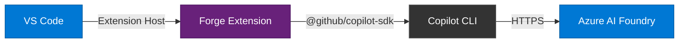
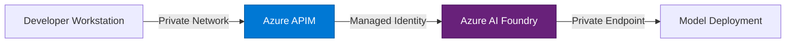

<style>
#slide-container > .absolute.bottom-0.left-0 {
  top: auto !important;
  left: auto !important;
  right: 1rem !important;
  bottom: 1rem !important;
  opacity: 1 !important;
  padding: 0 !important;
  z-index: 30;
}

#slide-container > .absolute.bottom-0.left-0 nav > div {
  display: flex;
  flex-wrap: wrap;
  align-items: center;
  gap: 0.375rem;
  padding: 0.5rem 0.625rem;
  border-radius: 0.75rem;
  background: rgba(15, 23, 42, 0.84);
  border: 1px solid rgba(148, 163, 184, 0.35);
  backdrop-filter: blur(8px);
  box-shadow: 0 12px 24px rgba(2, 6, 23, 0.35);
}

#slide-container > .absolute.bottom-0.left-0 .slidev-icon-btn {
  min-width: 2rem;
  min-height: 2rem;
  border-radius: 0.5rem;
  border: 1px solid rgba(148, 163, 184, 0.35);
  background: rgba(248, 250, 252, 0.12);
  color: #f8fafc;
  opacity: 1;
}

#slide-container > .absolute.bottom-0.left-0 .slidev-icon-btn:hover,
#slide-container > .absolute.bottom-0.left-0 .slidev-icon-btn:focus-visible {
  background: rgba(248, 250, 252, 0.2);
}

#slide-container > .absolute.bottom-0.left-0 .h-40px {
  color: #f8fafc;
  border-left: 1px solid rgba(148, 163, 184, 0.35);
  margin-left: 0.25rem;
  padding-left: 0.5rem;
}

#slide-container > .absolute.bottom-0.left-0 .h-40px .opacity-50 {
  opacity: 0.8;
}

/* Gradient-border wrapper — gives the image a luminous ring */
.hero-image-wrapper {
  position: relative;
  display: inline-block;
  padding: 1.5px;
  border-radius: 1.125rem;
  background: linear-gradient(
    135deg,
    rgba(59, 130, 246, 0.55),
    rgba(124, 58, 237, 0.3),
    rgba(59, 130, 246, 0.12),
    rgba(124, 58, 237, 0.3),
    rgba(59, 130, 246, 0.55)
  );
  box-shadow:
    0 0 30px rgba(59, 130, 246, 0.14),
    0 0 60px rgba(99, 102, 241, 0.07),
    0 0 100px rgba(59, 130, 246, 0.03),
    0 20px 44px rgba(0, 0, 0, 0.32);
  animation: glow-breathe 5s ease-in-out infinite;
  transition: transform 0.5s cubic-bezier(0.4, 0, 0.2, 1),
              box-shadow 0.5s cubic-bezier(0.4, 0, 0.2, 1);
}

.hero-image-wrapper:hover {
  transform: scale(1.012);
  box-shadow:
    0 0 40px rgba(59, 130, 246, 0.22),
    0 0 80px rgba(99, 102, 241, 0.11),
    0 0 120px rgba(59, 130, 246, 0.05),
    0 24px 48px rgba(0, 0, 0, 0.38);
}

/* The image itself — sits inside the gradient ring */
.hero-image {
  display: block;
  border-radius: 1rem;
  border: none;
  box-shadow: inset 0 1px 0 rgba(255, 255, 255, 0.04);
  transition: filter 0.5s ease;
}

.hero-image-wrapper:hover .hero-image {
  filter: brightness(1.03);
}

/* Slow glow pulse — subtle enough to feel alive, not distracting */
@keyframes glow-breathe {
  0%, 100% {
    box-shadow:
      0 0 30px rgba(59, 130, 246, 0.14),
      0 0 60px rgba(99, 102, 241, 0.07),
      0 0 100px rgba(59, 130, 246, 0.03),
      0 20px 44px rgba(0, 0, 0, 0.32);
  }
  50% {
    box-shadow:
      0 0 36px rgba(59, 130, 246, 0.19),
      0 0 72px rgba(99, 102, 241, 0.09),
      0 0 110px rgba(59, 130, 246, 0.05),
      0 20px 44px rgba(0, 0, 0, 0.32);
  }
}
</style>

<div class="flex flex-col items-center justify-center h-full">
  <div class="hero-image-wrapper mb-8">
    
  </div>
  <p class="text-xl text-gray-400 !leading-8">
    AI Chat for Air-Gapped Environments
  </p>
  <p class="text-sm text-gray-500 mt-4">
    A VS Code extension powered by Azure AI Foundry
  </p>
</div>

---
layout: center
---

# The Problem

- Enterprises need **AI-powered developer chat** inside VS Code
- Public AI endpoints violate **compliance, data sovereignty, and security** requirements
- Air-gapped and sovereign cloud networks **cannot reach external services**
- Teams need **full control** over which models are deployed and where inference runs

---

# What is Forge?

A VS Code extension that routes AI chat through **your** Azure AI Foundry endpoint.

- 🔒 **No GitHub auth required** — uses your Entra ID or API key
- 🏢 **Full tenant control** — all inference stays within your Azure subscription
- 🔌 **BYOK mode** — Bring Your Own Key via the GitHub Copilot SDK
- 🌐 **Air-gap ready** — works in disconnected, sovereign, and private networks
- 💬 **Rich chat experience** — multi-turn, streaming, code context, tool approval

---

# Architecture

How Forge routes inference through your private endpoint:



- **Forge Extension** manages chat UI, context attachments, and session lifecycle
- **Copilot CLI** handles model inference via the SDK's BYOK provider
- **Azure AI Foundry** runs your deployed models in your tenant — GPT-4.1, GPT-4o, o3, and more

---

# Key Features

<div class="grid grid-cols-2 gap-x-8 gap-y-2 mt-4">

- 🔑 **Dual auth** — Entra ID or API key
- 🤖 **Multi-model support** — switch between deployments
- ⚡ **Streaming responses** — real-time token delivery
- 📎 **Context attachments** — send selections, files, or workspace context
- 🛡️ **Tool approval** — user confirms before tool execution
- 🧠 **Workspace awareness** — understands your project structure
- ⏹️ **Stop generation** — cancel in-flight requests
- 🔄 **Multi-turn chat** — session reuse across conversations

</div>

---

# Getting Started

Four steps to your first chat:

**1. Install the extension**
> Search "Forge" in the VS Code Extensions panel, or sideload the `.vsix`

**2. Configure your endpoint**
```json
{
  "forge.copilot.endpoint": "https://resource.services.ai.azure.com/",
  "forge.copilot.models": ["gpt-4.1", "gpt-4o"]
}
```

**3. Authenticate**
> Choose Entra ID (default) or store an API key via the command palette

**4. Start chatting**
> Open the Forge panel and ask a question — streaming responses begin immediately

---

# Enterprise Architecture

<div class="grid grid-cols-2 gap-8 mt-4">
<div>

**Private networking**

- Azure Private Endpoints
- ExpressRoute / VPN tunnels
- No public internet required

</div>
<div>

**Governance & observability**

- Azure API Management gateway
- Token usage & audit logging
- Entra ID conditional access policies
- Model deployment controls

</div>
</div>



---

# Built With

<div class="grid grid-cols-2 gap-8 mt-8">
<div>

### Runtime

- **GitHub Copilot SDK** — `@github/copilot-sdk` v0.1.26
- **VS Code Extension API** — WebviewViewProvider
- **TypeScript** — strict mode, full type safety

</div>
<div>

### Toolchain

- **esbuild** — fast bundling for extension host
- **vitest** — unit testing with VS Code mocks
- **ESLint** — code quality enforcement

</div>
</div>

---
layout: center
class: text-center
---

# Get Started with Forge

<div class="text-lg mt-4 mb-8 text-gray-400">
AI chat that stays within your walls.
</div>

<div class="grid grid-cols-3 gap-8 mt-8 text-sm">

<div>

📦 **Repository**

[github.com/robpitcher/forge](https://github.com/robpitcher/forge)

</div>

<div>

🏪 **VS Code Marketplace**

Search "Forge" in Extensions

</div>

<div>

📖 **Documentation**

[Configuration Reference](https://github.com/robpitcher/forge/blob/main/docs/configuration-reference.md)

</div>

</div>
