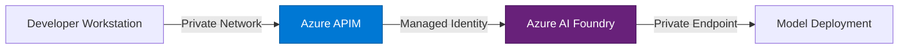

<div class="flex flex-col items-center justify-center h-full">
  
  <p class="text-xl text-gray-400 !leading-8">
    AI Chat for Air-Gapped Environments
  </p>
  <p class="text-sm text-gray-500 mt-4">
    A VS Code extension powered by Azure AI Foundry
  </p>
</div>

---
layout: center
---

# The Problem

- Enterprises need **AI-powered developer chat** inside VS Code
- Public AI endpoints violate **compliance, data sovereignty, and security** requirements
- Air-gapped and sovereign cloud networks **cannot reach external services**
- Teams need **full control** over which models are deployed and where inference runs

---

# What is Forge?

A VS Code extension that routes AI chat through **your** Azure AI Foundry endpoint.

- 🔒 **No GitHub auth required** — uses your Entra ID or API key
- 🏢 **Full tenant control** — all inference stays within your Azure subscription
- 🔌 **BYOK mode** — Bring Your Own Key via the GitHub Copilot SDK
- 🌐 **Air-gap ready** — works in disconnected, sovereign, and private networks
- 💬 **Rich chat experience** — multi-turn, streaming, code context, tool approval

---

# Architecture

How Forge routes inference through your private endpoint:


- **Forge Extension** manages chat UI, context attachments, and session lifecycle
- **Copilot CLI** handles model inference via the SDK's BYOK provider
- **Azure AI Foundry** runs your deployed models in your tenant — GPT-4.1, GPT-4o, o3, and more

---

# Key Features

<div class="grid grid-cols-2 gap-x-8 gap-y-2 mt-4">

- 🔑 **Dual auth** — Entra ID or API key
- 🤖 **Multi-model support** — switch between deployments
- ⚡ **Streaming responses** — real-time token delivery
- 📎 **Context attachments** — send selections, files, or workspace context
- 🛡️ **Tool approval** — user confirms before tool execution
- 🧠 **Workspace awareness** — understands your project structure
- ⏹️ **Stop generation** — cancel in-flight requests
- 🔄 **Multi-turn chat** — session reuse across conversations

</div>

---

# Getting Started

Four steps to your first chat:

**1. Install the extension**
> Search "Forge" in the VS Code Extensions panel, or sideload the `.vsix`

**2. Configure your endpoint**
```json
{
  "forge.copilot.endpoint": "https://resource.services.ai.azure.com/",
  "forge.copilot.models": ["gpt-4.1", "gpt-4o"]
}
```

**3. Authenticate**
> Choose Entra ID (default) or store an API key via the command palette

**4. Start chatting**
> Open the Forge panel and ask a question — streaming responses begin immediately

---

# Enterprise Architecture

<div class="grid grid-cols-2 gap-8 mt-4">
<div>

**Private networking**

- Azure Private Endpoints
- ExpressRoute / VPN tunnels
- No public internet required

</div>
<div>

**Governance & observability**

- Azure API Management gateway
- Token usage & audit logging
- Entra ID conditional access policies
- Model deployment controls

</div>
</div>



---

# Built With

<div class="grid grid-cols-2 gap-8 mt-8">
<div>

### Runtime

- **GitHub Copilot SDK** — `@github/copilot-sdk` v0.1.26
- **VS Code Extension API** — WebviewViewProvider
- **TypeScript** — strict mode, full type safety

</div>
<div>

### Toolchain

- **esbuild** — fast bundling for extension host
- **vitest** — unit testing with VS Code mocks
- **ESLint** — code quality enforcement

</div>
</div>

---
layout: center
class: text-center
---

# Get Started with Forge

<div class="text-lg mt-4 mb-8 text-gray-400">
AI chat that stays within your walls.
</div>

<div class="grid grid-cols-3 gap-8 mt-8 text-sm">

<div>

📦 **Repository**

[github.com/robpitcher/forge](https://github.com/robpitcher/forge)

</div>

<div>

🏪 **VS Code Marketplace**

Search "Forge" in Extensions

</div>

<div>

📖 **Documentation**

[Configuration Reference](https://github.com/robpitcher/forge/blob/main/docs/configuration-reference.md)

</div>

</div>
